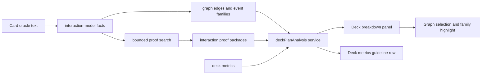

# Deck plan analysis

This document tracks the full deck-breakdown flow introduced after tagging
`stable-1.0`. The goal is to explain the deck's actual plan, not only assign
separate win, cohesion, and self-sufficiency scores.

## Plan

1. Preserve `main` as the stable 1.0 baseline.
2. Promote real mechanical packages from the graph/proof layers into a
   deck-level plan model.
3. Show that model in the browser as an inspection surface: primary plan,
   engine packages, core cards, support shell, review queue, and off-plan cards.
4. Feed the same plan score back into the existing guideline panel so the
   sidebar and breakdown page agree.
5. Keep the implementation deterministic, bounded, and documented. This is not
   a full rules simulator.

## Completed steps

- Created annotated tag `stable-1.0` on the pre-change `main` commit.
- Added `tap-free-cast→untap-engine` classification for Codie-style tap engines
  plus cheap instant untap/reset spells.
- Added bounded proof-search and proof-package support for that value-engine
  family.
- Verified the motivating Moxfield Codie deck no longer reads as 0 cohesion:
  the new family gives the graph a meaningful strong package instead of only
  weak ramp-to-sink edges.
- Added `src/web/services/deckPlanAnalysis.ts` to merge proof packages and
  meaningful graph families into a product-facing deck plan.
- Added `DeckPlanAnalysis.vue` and wired it into the Deck breakdown page.
- Updated `deckGuideMetrics.ts` so the headline Deck plan guideline uses the
  deck-plan score and summary when available.
- Added focused tests for the service, sidebar guideline integration, app smoke
  coverage, classifier recognition, proof search, and proof package seeding.
- Split convoke out of generic `ramp→sink` detection into directed
  `convoke-fodder→payoff` and `convoke-spell→payoff` families, so token-convoke
  decks explain their actual plan without replacing one fan-out with another.
- Removed the generic `sac-fodder→outlet` body-to-outlet fan-out. Sacrifice
  engines now need an actual payoff family such as `death→draw`, `death→drain`,
  `death→tokens`, or a proven loop to contribute to the plan.
- Replaced the undirected `graveyard` mega-clique with
  `graveyard-fuel→recursion`, preserving self-mill/surveil into recursion while
  avoiding recursion-to-recursion and incidental graveyard text cliques.
- Tightened `lord→tribe` so only typed lords connect to creatures with the
  matching subtype. Generic team anthems and commander/legendary-only buffs no
  longer weak-link to every creature as tribal evidence.
- Tightened generic counter consumers by removing the broad `counter on` catch.
  `proliferate→counters` and `counter-multiplier` now rely on explicit
  high-signal counter axes such as `+1/+1`, loyalty, charge, poison, or
  fabricate instead of named burden counters like delay/depletion/incarnation.
- Tightened `attach` so Equipment, creature Auras, and player Curses no longer
  form generic gear-to-gear or Equipment-to-Curse cliques. Attachment sources
  now connect to explicit attach/equip payoffs through
  `attachment-source→payoff`; the old generic `attach` reaction no longer fires
  on ordinary `equipped creature` text. In the 2026-06-26 score-corpus run this
  dropped watched `attach` edges from 412 to 18 in the precon corpus and from
  2781 to 2 in the Moxfield bracket corpus, with validation recall and sampled
  precision still at 1.0 and bracket accuracy unchanged.

## Data flow

The service consumes only existing graph payload fields:

- `graph.nodes`
- `graph.edges`
- `graph.eventLabels`
- `graph.interactionProofs`
- `metrics.cohesionScore`
- `metrics.winTuningScore`
- `metrics.winTuningSignals`

It returns a compact `DeckPlanAnalysis` object with:

- `primaryPlan` and `primaryFamily`
- `score`, `label`, and `summary`
- plan signals for density, package count, cohesion, closure, and off-plan
  control
- engine packages from strict proofs and meaningful interaction families
- core engine cards
- support shell cards
- weak spots
- off-plan cards

## Boundaries

- The analysis is deterministic and graph-derived. It does not inspect deck
  names, external combo labels, or manually curated card-name combos.
- A graph family can explain "these cards mechanically support the same plan".
  A proof package can explain a bounded direct package. Neither claim should be
  described as a complete game-state proof unless `interaction-proof-search.js`
  proves it.
- Off-plan cards are review candidates, not automatic cuts. The model currently
  treats unlinked non-support nonlands as suspicious because they do not explain
  themselves through the graph.
- Support shell detection is intentionally conservative: ramp, draw, tutor,
  removal, wipes, protection, and equivalent text-derived capabilities.

## Sample data policy

During model work, local sample data is allowed to live wherever it is most
useful: checked-in `data/`, ignored `analysis/` caches, or `work/` scratch
outputs. The scoring scripts should prefer available local files over path
purity. We care that the corpus is reproducible on the machine and summarized by
one command; we do not currently require every exploratory sample artifact to be
checked in.

Use `npm run report:score-corpus` for the compact view. It intentionally reads
from the local sample/corpus files that exist, including ignored bracket caches
such as `analysis/bracket/moxfield-reference-decks.json` and
`analysis/bracket/moxfield-bracket-corpus.json`.

Known false-positive inflation families are tracked in
`analysis/interaction-inflation-watchlist.json`. The score-corpus report
summarizes those families separately when reference deck caches are available,
so recall gains can be judged apart from generic fan-out such as ramp-to-sink,
graveyard cliques, or broad lord/anthem wiring.

## Next steps

- Add more commander-centric value-engine families where the same pattern
  appears: tap engine plus reset, cast trigger plus cheap recast, graveyard
  engine plus repeatable recursion.
- Add archetype-level clusters over existing families so a deck can be called
  "spellslinger", "aristocrats", "landfall", or "combat counters" when multiple
  related families point together.
- Expand the review queue into actionable suggestions once recommendations can
  score cards against a detected plan family.
- Add corpus reporting for plan labels and off-plan counts so model changes can
  be audited across many public decks instead of only hand fixtures.
